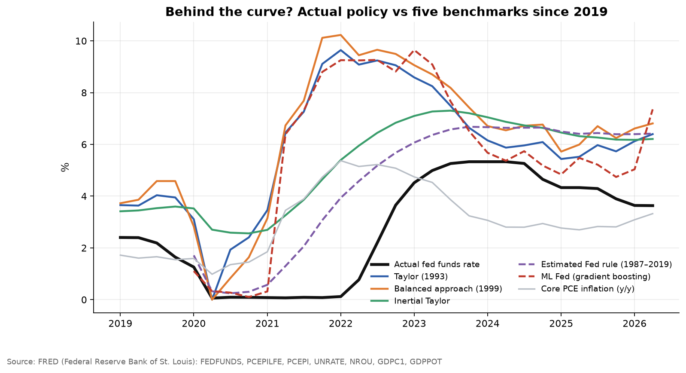
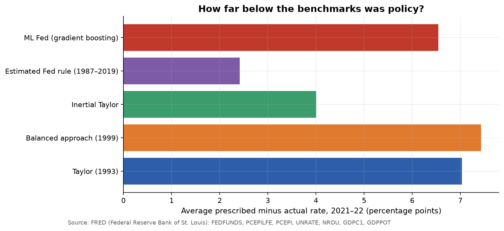
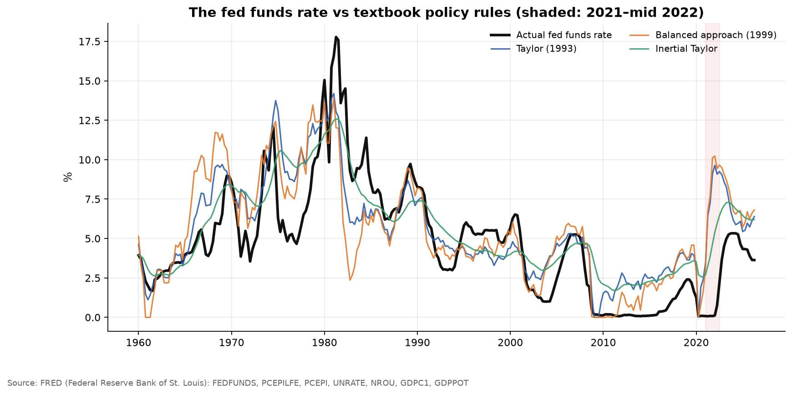

# How Late Was the Fed? Measuring "Behind the Curve" in 2021-22

US core PCE inflation passed 3% in spring 2021 and peaked above 5%, yet the Federal Reserve kept rates at zero until **March 2022**. "The Fed was behind the curve" is now conventional wisdom. **Behind which curve, and by how much?**

This repo turns the phrase into numbers. It compares the actual fed funds rate against five benchmarks for where it "should" have been, including an ML model of how the Fed itself behaved before 2020.

## Data (FRED, pulled live)
| Series | Code |
|---|---|
| Effective fed funds rate | `FEDFUNDS` |
| Core PCE price index / headline PCE | `PCEPILFE` / `PCEPI` |
| Real GDP / CBO potential GDP | `GDPC1` / `GDPPOT` |
| Unemployment rate / CBO natural rate | `UNRATE` / `NROU` |

Quarterly, 1960s to latest. Inflation is year-on-year. The output gap is `100 × (GDP / potential − 1)`.

## Benchmarks
| Benchmark | Rule |
|---|---|
| Taylor (1993) | `i = 2 + π + 0.5(π − 2) + 0.5·gap` |
| Balanced approach (1999) | Same, with 1.0 on the output gap |
| Inertial Taylor | `i = 0.85·i₋₁ + 0.15·Taylor`, iterated on its own path |
| **Estimated Fed rule** | Partial-adjustment reaction function `i = c + ρ·i₋₁ + β·π + γ·gap` estimated on 1987–2019 (HAC SEs), then **simulated dynamically** from 2020 on its own lagged rate |
| **ML Fed** | Gradient boosting trained on 1987–2019 (core and headline inflation, output gap, unemployment gap, inflation momentum). It asks: *what would the Greenspan-to-Powell Fed have done with 2021–22 data?* |

All prescriptions are floored at zero, the effective lower bound. "Quarters late" is the gap between the first quarter each benchmark calls for rates of at least 0.75% and the actual liftoff.

## Results
<!-- RESULTS:START -->
_Auto-generated by `run.py` on 2026-09-25. Numbers refresh whenever the pipeline re-runs._

### Headline numbers

- Actual liftoff: **March 2022** (2022Q1).
- Across benchmarks, policy was on average **2.4–7.4 pp** below the prescribed rate over 2021–22, and **6 quarters** late (median across benchmarks).
- Estimated Fed reaction function 1987–2019: smoothing ρ = **0.88**, long-run inflation response **1.48** (Taylor principle requires > 1), output-gap response **1.30**.
- Gradient-boosting Fed trained only on 1987–2019 behaviour (rolling-origin CV RMSE 2.10 pp; it cannot extrapolate beyond rates seen in training, so treat it as a lower bound).

### Benchmarks

| Benchmark | Avg gap 2021–22 (pp) | Peak gap (pp) | Rule says hike (quarter) | Quarters late |
|---|---|---|---|---|
| Taylor (1993) | 7.03 | 9.52 | 2020Q3 | 6 |
| Balanced approach (1999) | 7.43 | 10.11 | 2020Q3 | 6 |
| Inertial Taylor | 4.00 | 5.28 | 2020Q3 | 6 |
| Estimated Fed rule (1987–2019) | 2.42 | 3.82 | 2021Q2 | 3 |
| ML Fed (gradient boosting) | 6.54 | 9.13 | 2021Q2 | 3 |

### Estimated reaction function (1987Q3–2019Q4, HAC SEs)

| Term | Coef | SE | p |
|---|---|---|---|
| Intercept | 0.071 | 0.141 | 0.616 |
| ff_lag | 0.876 | 0.032 | 0.000 |
| core | 0.184 | 0.091 | 0.044 |
| gap | 0.162 | 0.046 | 0.000 |

### Figures

**Behind the curve since 2019**



**Average gap by benchmark**



**Rules vs actual since 1960s**



<!-- RESULTS:END -->

### What it means
- **By the Fed's own standards, liftoff came about three quarters late.** A reaction function estimated on 1987–2019 calls for the first hike around 2021Q2, and rates averaging roughly 2.4 pp higher through 2021–22 than they were.
- **Textbook rules overstate the gap.** Taylor-type rules imply rates 7 pp higher and liftoff in late 2020, but they assume the Fed moves straight to the prescribed rate and use today's revised output-gap estimates. Real central banks move gradually and see only real-time data.
- **The pre-2020 Fed satisfied the Taylor principle.** Its long-run response to inflation was about 1.5, above the threshold of 1. The 2021 delay reflects the new average-inflation-targeting framework and the view that inflation was "transitory", not a Fed that historically ignored inflation.

## Reproduce
```bash
pip install -r requirements.txt
python run.py
```
The GitHub Action re-pulls FRED and re-runs on push and monthly.

## Limitations
- Potential GDP and r* are unobserved and revised over time. This uses today's vintage (CBO potential, r* = 2%), not what the Fed saw in real time, which flatters hindsight. Orphanides (2003) shows how much real-time data matter.
- The 2020 framework change (flexible average inflation targeting) deliberately allowed overshooting, so a pre-2020 benchmark partly measures the *regime change* rather than a mistake.
- Tree models cannot extrapolate beyond rates seen in training, so the ML Fed is a conservative benchmark.
- Balance-sheet policy (QE/QT) is ignored. Shadow-rate estimates would change the pre-2022 picture.

## References
- Taylor, J. (1993). *Discretion versus policy rules in practice.* Carnegie-Rochester Conference Series.
- Clarida, R., Galí, J. & Gertler, M. (2000). *Monetary policy rules and macroeconomic stability.* QJE.
- Orphanides, A. (2003). *Historical monetary policy analysis and the Taylor rule.* Journal of Monetary Economics.
- Bernanke, B. & Blanchard, O. (2023). *What caused the US pandemic-era inflation?* Brookings/PIIE.
